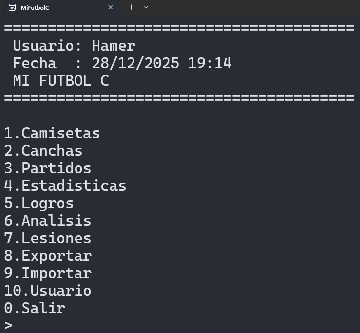
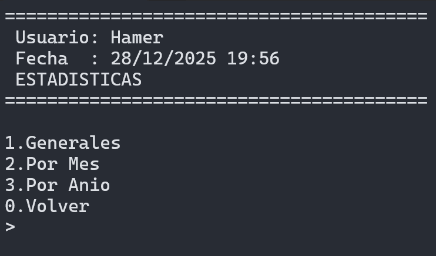

# Manual de Usuario - MiFutbolC

## Introducción

Bienvenido a **MiFutbolC**, un sistema de gestión de datos para fútbol desarrollado en lenguaje C. Esta aplicación permite administrar camisetas, canchas, partidos, estadísticas, logros, análisis de rendimiento, lesiones y exportar datos en múltiples formatos. Utiliza SQLite como base de datos para almacenar toda la información de manera persistente y eficiente.


## Requisitos del Sistema

- **Sistema Operativo**: Windows, Linux o macOS
- **Compilador C**: GCC o MinGW
- **Herramientas Adicionales**:
  - CodeBlocks (recomendado)
  - Pandoc (para generar este manual en PDF)

## Instalación y Compilación

### Opción 1: Usando CodeBlocks

1. Descarga e instala CodeBlocks desde [codeblocks.org](https://www.codeblocks.org/)
2. Abre el archivo `MiFutbolC.cbp` con CodeBlocks
3. Selecciona "Build" > "Build" para compilar
4. El ejecutable se generará en `bin/Debug/MiFutbolC.exe`

### Opción 2: Compilación Manual

```bash
gcc -o MiFutbolC main.c db.c menu.c camiseta.c partido.c estadisticas.c analisis.c cancha.c logros.c lesion.c export.c export_all.c import.c utils.c sqlite3.c cJSON.c cJSON_Utils.c -I.
```

## Primer Uso

Al ejecutar el programa por primera vez, se te pedirá que ingreses tu nombre de usuario. Este nombre se guardará para futuras sesiones.


## Menú Principal

El menú principal ofrece las siguientes opciones:

1. **Camisetas** - Gestionar camisetas de fútbol
2. **Canchas** - Gestionar canchas de fútbol
3. **Partidos** - Gestionar partidos
4. **Estadísticas** - Ver estadísticas generales
5. **Logros** - Gestionar logros y badges
6. **Análisis** - Ver análisis de rendimiento
7. **Lesiones** - Gestionar lesiones de jugadores
8. **Exportar** - Exportar datos
9. **Importar** - Importar datos
10. **Usuario** - Gestionar usuario
0. **Salir** - Cerrar el programa



## Gestión de Camisetas

### Crear una Camiseta

1. Selecciona "1" en el menú principal
2. Elige "1" para crear una nueva camiseta
3. Ingresa el nombre de la camiseta
4. La camiseta se guardará en la base de datos

### Listar Camisetas

1. Selecciona "1" en el menú principal
2. Elige "2" para listar todas las camisetas

### Editar una Camiseta

1. Selecciona "1" en el menú principal
2. Elige "3" para editar una camiseta
3. Ingresa el ID de la camiseta a editar
4. Modifica el nombre según sea necesario

### Eliminar una Camiseta

1. Selecciona "1" en el menú principal
2. Elige "4" para eliminar una camiseta
3. Ingresa el ID de la camiseta a eliminar
4. Confirma la eliminación


## Gestión de Canchas

### Crear una Cancha

1. Selecciona "2" en el menú principal
2. Elige "1" para crear una nueva cancha
3. Ingresa el nombre de la cancha
4. Ingresa la ubicación de la cancha

### Listar Canchas

1. Selecciona "2" en el menú principal
2. Elige "2" para listar todas las canchas

### Editar una Cancha

1. Selecciona "2" en el menú principal
2. Elige "3" para editar una cancha
3. Ingresa el ID de la cancha a editar
4. Modifica el nombre y ubicación según sea necesario

### Eliminar una Cancha

1. Selecciona "2" en el menú principal
2. Elige "4" para eliminar una cancha
3. Ingresa el ID de la cancha a eliminar
4. Confirma la eliminación


## Gestión de Partidos

### Crear un Partido

1. Selecciona "3" en el menú principal
2. Elige "1" para crear un nuevo partido
3. Selecciona la cancha
4. Ingresa la fecha y hora
5. Ingresa los goles, asistencias, rendimiento, cansancio, ánimo
6. Selecciona la camiseta utilizada

### Listar Partidos

1. Selecciona "3" en el menú principal
2. Elige "2" para listar todos los partidos

### Modificar un Partido

1. Selecciona "3" en el menú principal
2. Elige "3" para modificar un partido
3. Ingresa el ID del partido a modificar
4. Actualiza los datos según sea necesario

### Eliminar un Partido

1. Selecciona "3" en el menú principal
2. Elige "4" para eliminar un partido
3. Ingresa el ID del partido a eliminar
4. Confirma la eliminación


## Estadísticas

Selecciona "4" en el menú principal para ver estadísticas generales del sistema, incluyendo:

- Camiseta con más goles
- Camiseta con más asistencias
- Camiseta con más partidos
- Camiseta con más goles + asistencias



## Logros

Selecciona "5" en el menú principal para acceder al sistema de logros y badges. Los logros están organizados por categorías y niveles de dificultad.

### Ver Todos los Logros

1. Selecciona "5" en el menú principal
2. Elige "1" para ver todos los logros

### Ver Logros Completados

1. Selecciona "5" en el menú principal
2. Elige "2" para ver logros completados

### Ver Logros en Progreso

1. Selecciona "5" en el menú principal
2. Elige "3" para ver logros en progreso


## Análisis de Rendimiento

Selecciona "6" en el menú principal para ver el análisis de rendimiento, que incluye:

- Comparación de los últimos 5 partidos con promedios generales
- Cálculo de rachas de victorias y derrotas
- Análisis motivacional basado en el rendimiento

## Gestión de Lesiones

### Registrar una Lesión

1. Selecciona "7" en el menú principal
2. Elige "1" para registrar una nueva lesión
3. Ingresa el nombre del jugador
4. Selecciona el tipo de lesión
5. Ingresa la fecha y duración

### Listar Lesiones

1. Selecciona "7" en el menú principal
2. Elige "2" para listar todas las lesiones

### Editar una Lesión

1. Selecciona "7" en el menú principal
2. Elige "3" para editar una lesión
3. Ingresa el ID de la lesión a editar
4. Modifica los datos según sea necesario

### Eliminar una Lesión

1. Selecciona "7" en el menú principal
2. Elige "4" para eliminar una lesión
3. Ingresa el ID de la lesión a eliminar
4. Confirma la eliminación


## Exportar Datos

Selecciona "8" en el menú principal para exportar todos los datos en múltiples formatos (CSV, TXT, JSON, HTML). Los archivos se guardarán en el directorio `data/`.


## Importar Datos

Selecciona "9" en el menú principal para importar datos desde archivos JSON. Los archivos deben estar en el directorio `data/` con nombres específicos.


## Gestión de Usuario

Selecciona "10" en el menú principal para cambiar el nombre de usuario o ver información del usuario actual.


## Consejos de Uso

- Siempre confirma las operaciones de eliminación
- Utiliza la función de exportación regularmente para hacer copias de seguridad
- Revisa las estadísticas y análisis para mejorar el rendimiento
- Completa logros para motivarte a usar la aplicación

## Solución de Problemas

### El programa no se ejecuta

- Verifica que el archivo ejecutable existe en `bin/Debug/MiFutbolC.exe`
- Asegúrate de tener permisos para ejecutar archivos en el directorio

### Error al conectar con la base de datos

- Verifica que el directorio `data/` existe y tienes permisos de escritura
- El programa creará automáticamente la base de datos si no existe

### Datos no se guardan

- Verifica que no hay errores en la consola
- Revisa que la base de datos no esté corrupta

## Conclusión

MiFutbolC es una herramienta completa para el seguimiento y análisis de datos relacionados con el fútbol. Con su interfaz intuitiva y funcionalidades avanzadas, te permite gestionar todos los aspectos de tu experiencia futbolística.

¡Disfruta usando MiFutbolC!

---

*Manual generado con Pandoc*
*Última actualización: (28/12/2025)*
